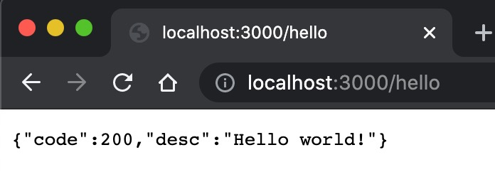

bear-docker-nginx
====================================================

Add the module (njs, http_headers_more) to the official method, and provide the basic template out of the box

## Getting Started
```bash
$ git clone https://github.com/imagine10255/bear-docker-nginx.git site-dev
$ cd site-dev

# remove git version control
$ rm -rf ./.git

# Option (first create network)
$ docker network create --driver bridge imdockgroup

# Starting
$ docker-compose up
```

> open test [http://localhost:8080/hello](http://localhost:8080/hello)
>
> open test [http://localhost:8080/test.html](http://localhost:8080/test.html)




## How to use utils

use can be executed directly
```bash
$ chmod a+x ./utils.sh
```

executed
```bash
$ utils.sh
```

## Custom Config
add config to docker-compose.yml

```
volumes:
    - "./config/nginx/conf.d:/etc/nginx/conf.d"
    - "/home/adminuser/service/ftp-server/data:/etc/nginx/html:ro"
```

```
# options:
    - "./config/nginx/nginx.conf:/etc/nginx/nginx.conf"
    - "./config/nginx/site-modules:/etc/nginx/site-modules"
```

## Reference Architecture:

```txt
bear-docker-nginx
├── config/nginx
|           ├── conf.d           # site config
|           ├── site-module      # site module
|           |    ├── njs         # site module
|           |    └── proxy.conf  # site module
|           └── nginx.conf       # nginx config
├── public                       # site static files
└── docker-compose.yml
```


## Modify Build
modify dockerfile
```bash
ARG ENABLED_MODULES="ndk headers-more"
```

run build
```bash
$ docker build . -t imagine10255/bear-docker-nginx:1.0.8
$ docker push imagine10255/bear-docker-nginx:1.0.8

$ docker tag imagine10255/bear-docker-nginx:1.0.8 imagine10255/bear-docker-nginx:latest
$ docker push imagine10255/bear-docker-nginx:latest
```

## Ref
- [use module issue](https://github.com/nginxinc/docker-nginx/issues/511#issuecomment-857555895)
- [use module step](https://github.com/nginxinc/docker-nginx/tree/master/modules#readme)
- [njs sample](https://www.gushiciku.cn/pl/gJu3/zh-tw)
